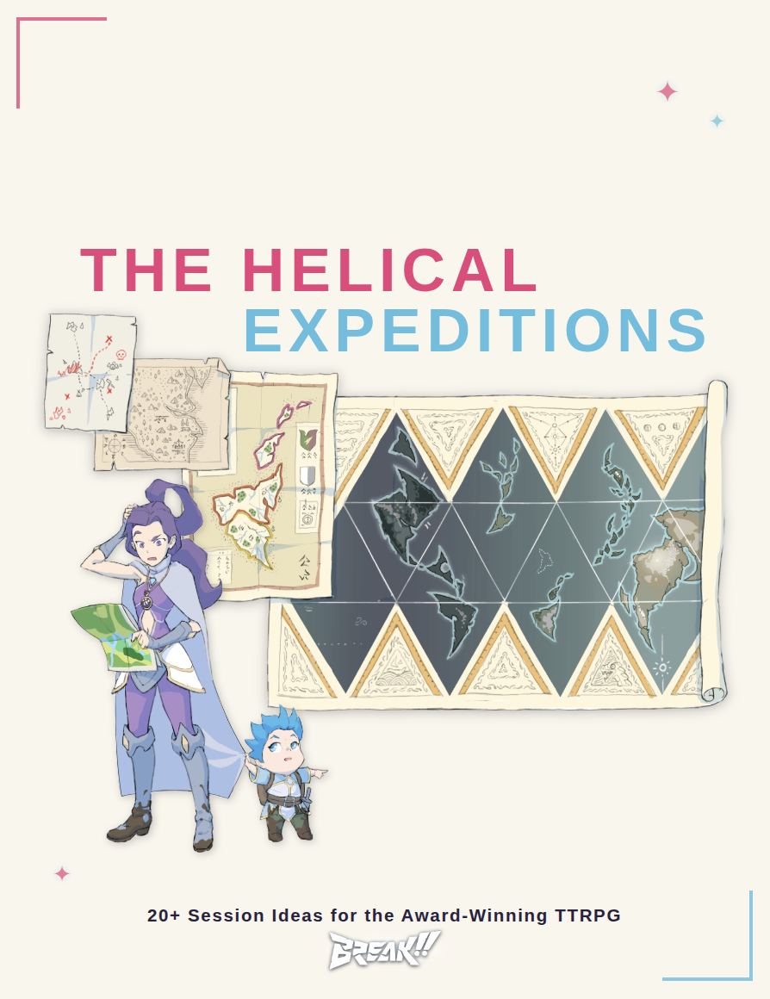
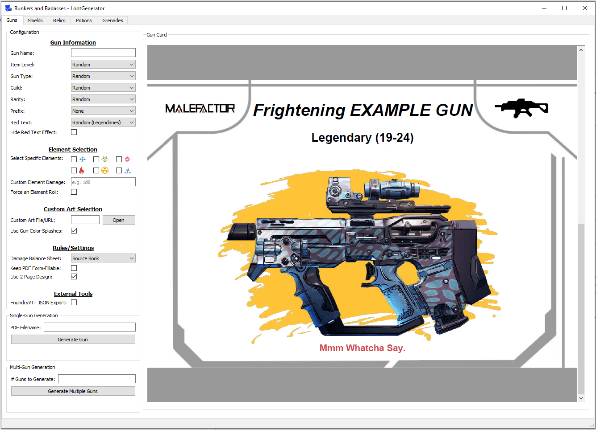

# Studio Quagg

**Website:** [its.quagg.studio](https://its.quagg.studio)

Welcome to Studio Quagg - my collection of tabletop RPG homebrew content, digital tools, and creative projects. This repository hosts the source for my personal website.

## What's Here

### BREAK!! Homebrew Content

[**BREAK!!**](https://breakrpg.com/) is an anime and video game inspired TTRPG by Reynaldo Madriñan and Carlo Tartaglia, set in the Outer World - a post-apocalyptic realm of floating islands and diverse cultures.

#### The Helical Expeditions *(Work in Progress)*

<table>
<tr>
<td width="60%">

**The Helical Expeditions** is a (WIP) collection of 2-3 page adventure modules designed as one-shots for the **BREAK!!** RPG system. Adventures are set across the diverse regions of the Outer World, featuring complete character write-ups, location details, story outlines, and fleshed-out Adventure Sites.

These adventures are united by a loose framing device - the *Helical Archive*, a globe-spanning research organization that sends adventurers to investigate mysteries, protect endangered creatures, and explore forgotten ruins. Each module can be run standalone or woven into an ongoing campaign.

</td>
<td width="40%">

</td>
</tr>
</table>

#### FLIGHT!! Heist of the Crimson Corsair

**FLIGHT!! Heist of the Crimson Corsair** is a full-length heist adventure adapted for the **BREAK!!** RPG system. The party joins the Cloudstriders - an infamous band of sky mercenaries riding bonded skyrays - to extract a mysterious person from one of the Duke of Red Roses' airships. This person holds secrets to accessing the Hall of Truths, a legendary reliquary beneath the Shining Sea.

Starting *in media res* aboard the Nightjar, players explore the resort island of Oki Island, gather intel at casinos and carnival games, and ultimately decide: will they complete the heist for the Cloudstriders, or be tempted by the Duke's offer?

This adventure is a **BREAK!!** adaptation of the wonderful Eberron adventure 'Flight of the Magpies' by Marco Michelutto.

#### Mystery of Mrs. Miggins' Pies

**Mystery of Mrs. Miggins' Pies** is an introductory adventure designed for 2-4 Rank 2 Adventurers, perfect for new groups learning the **BREAK!!** system. When Mundymutts ransack the legendary pie shop and steal Mrs. Miggins' secret spice mix, the party must investigate the crime and uncover a jealous rival's plot.

Set in the stilt-raised village of Roost on the edge of the Murk, this adventure introduces players to core mechanics including Negotiation, Journey hazards, Exploration, and Combat while weaving a lighthearted mystery with memorable NPCs like the tattoo-punk elf Mrs. Miggins and the dramatically armored Symon "the Pieman."

This adventure is a **BREAK!!** adaptation of 'The Goblins and the Pie Shop' by guyeatsfood.

#### Homebrew Adversary Compendium

A public compendium of **BREAK!!** homebrewed Adversaries in a quick-to-digest format. It's intentionally light on flavor/art/etc to make it as easy as possible to search up an Adversary on the fly and run with it. The sheet includes a Google Form to submit your own homebrew creations.

#### Homebrew Species

Custom species created for **BREAK!!** campaigns. Each species page follows the format found in the core rulebook with lore, outlook, and mechanical abilities.

- **Shimmershells** - Squat, iridescent crustaceans with twilight-hued shells. Born from a fusion of calm sea creatures and magical fungi during the Sundering, they now serve as harmonious stewards of the Twilight Balance.
- **Stiltkin** - Towering avian folk with hollow bones and fine, hair-like feathers. These reserved observers have lived in the Murk since any remember, their patient philosophies shaped by seasons of fishing and basket-weaving.

#### Skyship Racing Ruleset

Quick mechanics for racing Skyships in either a 'deathrun'-style race or in a dangerous escape scene. Designed to be light enough to pick up and run in a session while still allowing for the usual **BREAK!!** shenanigans.

#### Break-Sheet x Questline VTT Converter

A simple conversion tool for porting characters created in [Break-Sheet](https://nboughton.uk/apps/break-sheet/#/) to [Questline VTT](https://questlinevtt.com/home). Handles identity, abilities, inventory, weapons, and allegiances - just paste your JSON and convert!

### Traveller: Imperium Shipyard

[**Imperium Shipyard**](https://github.com/Imperium-Tech/imperium-shipyard) is an open-source spacecraft construction tool for *Mongoose Traveller 1st Edition*. This repository hosts the landing page and documentation for the project.

The application provides a visual interface for designing ships according to the official SRD rules, complete with automatic cost calculations, cargo tracking, and drive performance validation. Built with Python and PyQt5.

**Project Repository:** [github.com/Imperium-Tech/imperium-shipyard](https://github.com/Imperium-Tech/imperium-shipyard)

### Bunkers & Badasses: Loot Generator

<table>
<tr>

<td width="60%">

[**BnB Loot Generator**](https://github.com/qu-gg/BnB-LootGenerator) is an automated loot card generator for *Bunkers & Badasses*, the official Borderlands TTRPG. This repository hosts the landing page and showcase for the tool.

The desktop application automates gun rolling tables from the sourcebook and produces printable PDF cards with artwork pulled from the Borderlands games. Also supports shields, grenades, relics, potions, and melee weapons with FoundryVTT integration.

**Project Repository:** [github.com/qu-gg/BnB-LootGenerator](https://github.com/qu-gg/BnB-LootGenerator)

</td>
<td width="40%">

</td>

</tr>
</table>

## License & Attribution

All homebrew content here are independent products published under <strong><em>BREAK!!</em></strong> RPG's Non-Commercial License and are not affiliated with <strong><em>BREAK!!</em></strong>'s creators or publishers.

Individual tool projects (Imperium Shipyard, BnB Loot Generator) have their own licenses - see their respective repositories for details.

## Links

- **Website:** [its.quagg.studio](https://its.quagg.studio)
- **BREAK!! Official:** [breakrpg.com](https://breakrpg.com/)
- **GitHub:** [github.com/qu-gg](https://github.com/qu-gg)

---

*Last Updated: January 2026*
