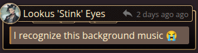

Welcome to Episode 42 of **BREAK!!: The Wandering Trio**, alternatively titled "why don't my players care about their lives"? Less prep yap this week, more just actionable reporting and explaining the little Chib terror known as Skippi. 

Note that I won't be explaining the Adventure Site and its lore in vivid detail here as I heavily dove into that in the previous [post](https://its.quagg.studio/blog/posts-html/2026-04-16-session-report-41-break-not-more-plants.html) alongside a dedicated full site [write-up](https://its.quagg.studio/blog/posts-html/2026-04-23-the-botanical-consortium-adventure-site.html). It is dense but I believe there are some fun tidbits in there!

Map Reference, as always:

### Skippi, the Asura of Ynn

For my players, Skippi means a headache. Skippi means anxiety. But for me, Skippi means that over the next scene I get to enjoy RP'ing a little terror. So, then, who is this 'lil shit? Welcome to what we call ||emergent, escalating development of a throwaway character turned Big Bad||.

The players first met Skippi in the cozy small fishing port village of Seneda on the northern half of Skyray Isle, very early on into the campaign (Episode 2, if memory serves). To understand the players' perceptions coming into this setting, some context is needed. Historically, Seneda had always been a small village no one paid any mind to throughout the greater Meridian. And so it was they enjoyed the quiet life...until the ruins of a sprawling Gleysian complex was found in the cliff's base to the south. Being the closest sea-capable "port" on top of having a road already built, Seneda quickly became the primary export hub for this tech rush, expanding rapidly. Dozens moved in, business sprang, and so on.

However, when the Water Spirits started suddenly sinking all ships near the island, trade routes dried up, leaving Seneda in a position with no real foundation to support the newly come population. People scattered - some inwards, some daring the sea - and only the stalwart families remained as they always have. Which, honestly, they preferred as it meant they could get back to a simple, cozy life.

."){: width="75%"}

Given the economic stupor the players found their own hometown in - the southern Celestial Bazaar near the ruins - their expectations going in were low, and that Seneda had to be in an even worse condition. Abandoned market stalls, an empty tavern with a stressed proprietor, and hastily-built houses now crumbling all supported this conception. So when a short, lavender-haired Scamp in beat-up clothes came running up to the party and tried to sell Gack his own watch back, they innately assumed "oh, a competent street orphan". Her signature phrase was "Hiya, misters!"

Here's her portrait, drawn by the great LeviLagann:

."){: width="35%"}

They liked the cut of her jib after the showcase of her legerdemain and offered to take her with them as they went to check on things in a nearby goblin-run workshop. No questions about her home, guardians, nada, off they went into the desert with Skippi. Along the route, she discussed various tactics to extort or scam people but, when nearly at the goblin junkyard, she casually quipped "one extortion I've always wanted to *try* is to threaten I've been kidnapped to my mom! That one sounds *effective*, no?" To this, the players all, in a horrified tone, blurted a unified: "wait...what?"

Over the entire next Adventure Site she'd give off vague threats, disappear without supervision to rob the goblin tinkerers, and perform reckless acts in the hostile scrapyard - all to my players' collective stress. But she lived and they all made it back to Seneda where a teary-eyed mother rushed up to Skippi and picked her up. With a knowing grin over her mother's shoulder, Skippi said the group "saved her bravely from some bandits!" and pinned the kidnapping on a local fishmonger (a competitor to Skippi's stew stall). The mother joyfully thanked the party and invited them over to dinner so they could discuss the events.

Players navigated the social situation well and didn't let the secret slip despite Skippi giving off concerning, vague recounts of the trip. All's well that ended well but damn did it sure scar my players. She didn't reappear for another 25 episodes but at many random times would they state something like "remember that devil Skippi?". Their paranoia was quite rightly placed, it turns out.

||Skippi was fully meant to be a short bit but, after the players kept bringing her back up and one even saying "I bet she's the big bad just you wait", I decided to take that into serious consideration. I knew fairly early on that I wanted the Idea of Thorns from Ynn to be the end goal since I received the gorgeous, printed book. However, the Idea needed eyes in Outer World since its body is sundered. I thought it funny if Skippi was not a child at all but an Asura who could change appearance, and her mother was just another spawn of Ynn. They were scoping out the party as potential candidates to complete the bridge between Outer World/Ynn, so she wanted to tag along and monitor them. The players getting to know her personality quite deeply and traveling with her for many sessions was great for villain building.||

Well, I say she didn't reappear for all that time but in actuality she appeared 3 total times under differing facades but with some shade of purple-y hair. One time she was a background member of a merchant gathering discussing economic issues, another time she was a tour guide called Molly they interacted with heavily, and the last was a short bio-mechanoid named SL1P on a floating raft village. They got a little suspicious of SL1P but overall didn't make concrete connections. I even used some variation of "Hiya" every time - to which one player said "man I thought that was just a bit for those character types".

Her long-awaited reveal as one of the Big Bads was amazing - she was the catalyst for the Idea's appearance in Outer World again by way of possessing Abra's father figure Taam, a powerful Sage that once sealed the Idea away. Sat on the Bazaar's central fountain with Taam bound by Mana, a simple "Hiya, misters!" was let off before I showed her token. It blindsided the players in the moment, with one shouting a hearty "I KNEW IT".

They have a very strong association to the name, the phrase, and this specific [music track](https://www.youtube.com/watch?v=qUMcdDOAMu4) now over the course of this campaign as all things to be stressed over. I don't overuse them so when I *do* it's all the better, like in today's session :)

Case in point:

Onto the session report.

### A Tale of Abandoning Caution

One would imagine that after haphazardly setting off a trap that nearly offed Gack the party would care about their well-being more. To be fair to them, they did, but only for about 10 minutes of the session. I suppose it's improvement.

Here is the Facility layout just for reference, with the party starting back in Room 5:

."){: width="65%"}

Post-trap, they all froze as I finally described the hallway and the very obvious Gleysian Terminal on the wall. They all paused and let Abra (who can read Gley Code) tinker away at it. All of them are day-time wizard hackers, thus tried pulling some fast ones on me with how to bypass this or that and get into the terminal. After a few failures, I reminded them of the keycard they received off the dead researcher top-side. This terminal opened up the Locker/Break room and disabled the trap, so they got on exploring.

They saw the break room abandoned hurriedly - with lockers open and personal effects all about. Using Cautious (Reckless) Movement only and always, they received all the information from this room - including a note about a Restricted Research Sector somewhere within. Lookus smartly activated his Scanner and got a heavy ping behind a seemingly "plain wall", which Gack confirmed as having traces of Flesh Mana near it. For context, one of the mutations Gack got while in Ynn was the ability to smell Mana which has been fun to play with in scene setting.

Rightly assuming nefarious hidden doors, they got trying to further bypass attmempts on the Terminal now that they had initial keycard access. I was real generous and gave them 3 attempts, noting that the final failure would come at a CLICK!! Trap being set off. They took the bet...and failed (Insight 14 btw). I improv'd the trap as the grumpy Gleysian equivalent of Clippy upset to be left and trapped here. Frayed wires came snaking out of the Terminal and shot towards Lookus and Abra's temples but they were both lucky and dodged appropriately.

Not ready to admit defeat (or just explore more, the keycard was later on in), Gack, rock laborer of New Ore, asked if he could take his rock mallet and hit the 3ft thick metal blast door open. I fucked up and said "uh no, but yeah sure, if you crit". And crit he did. Out of this malarkey, I at least gave a pretty slick description illustrating it like Last Airbender's Toph sensing the impurities of the metal and finding the perfect strike zone to crumble the door.

Onwards they went into the staging chamber that precedes the supergoop storage vessel beyond. I made it rather abundantly clear there were all manner of Anti-Hazard Outfits hung on the wall. Abra and Gack simply retorted that they were "sturdy enough to handle anything". Lookus had actually wanted to but was too embarassed to be seen in that "drab trash" on account of his Stylish Quirk. Thus, after being seared by chemicals in the purification airlock, I naturally had them all roll against Jellyfication from direct exposure to the supergoop. Gack failed and so we have our first Jellyfication of the campaign! They all got a kick out of the visual description of his entire silhouette being goopy (Factotum pack included). Gack's player proceeded to do an oozy voice, which was suprisingly good.

In the storage vessel, they got the Calian head researcher's notes about these failed experiment subjects (read the blog post it's evil stuff) and frustration with the Anchor Tree's instability. Notably, Abra deciphered that an antidote for the condition can be constructed out of clippings from the tree itself. Satisfied with the information and concerned with Gack gooping through the metal grated floor, they headed back out to explore deeper.

I had previously described the walls as being cracked and Gack took the Jellyfied condition to heart, immediately squeezing into the walls and exploring. It turned out to be pretty advantageous for them in exploring the Facility - Gack could peer an eye out of the next room steathily, get into ooze-filled chambers safely, and access the Anchor Tree's roots directly as they were suspended fully in ooze. In the experimentation room outside the root chambers, they found an Aken's Succor flower,  learned more about their half-mask, and about the Anchor Tree in the dome above them.

With nowhere to go but into the upper dome, they ascended the stairs to find a massively overgrown dome with vines and trees, alongside a feeling of sun-like warmth and gentle sound of music...that dreaded [waltz](https://www.youtube.com/watch?v=qUMcdDOAMu4). Playing the music put them immediately on high alert and we ended the session with a classic "Hiya, misters!"

."){: width="75%"}

And that's all for this episode of BREAK!!. I hope you enjoyed!
