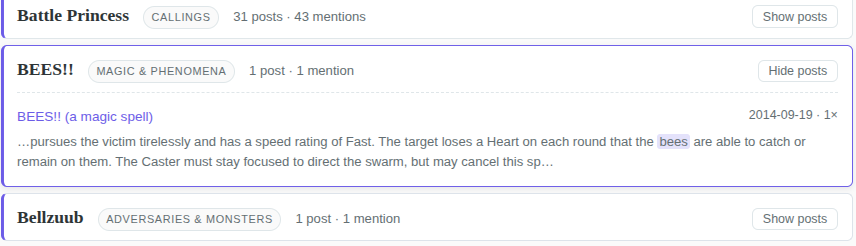
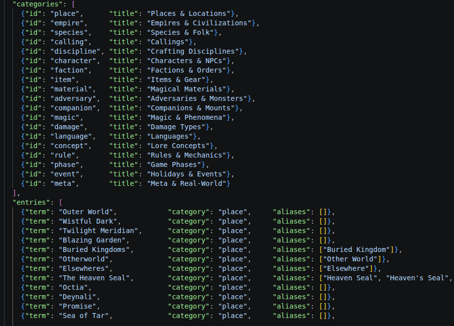

Bit of a different post today but a fun one nonetheless. After some discussion on the BREAK!! Discord on whether an index of the BREAK!! blog existed (turned out no), I decided to whip up a rough site for it. It is available [here](https://its.quagg.studio/break-blog-index/glossary.html).

### What can it do?

Basically it has a long list of 215 BREAK!!-specific glossary terms (e.g., Regions, Callings, etc.) pointing to posts which contain the words somewhere within it. It's like a book index but bloggy. As well, I built a pseudo-dynamic text search functionality where you can search the posts' contents for mention of any non-Glossary word (all offline). The goal is for someone wanting to search the BREAK!! blog on a specific topic to not have to use Blogspot's...lovely search engine.

The secondary bonus is how the data is formatted. You get to quickly see a lot of posts across topics, including BREAK!!'s early roots and journey over time - take, for example, this incredible BEES!! spell for example from 2014:

{: width="65%"}

### How was it done?

Besides just making a simple annoucement post saying this project exists, I thought it fun to dive a bit into the tech-stack behind it (simple as it might be). In essence, I've taken the blog's 400+ posts and - with permission by Rey using standard scraper ethics - scraped them all to my local machine and ran some matching scripts to build out the Glossary. This was nothing super fancy: it just brute force matches all words in each post to the glossary (alongside some alias terms), marking which links contain which. But the benefit is it is rerunnable whenever I want to update the Glossary and I can use Github Actions to automatically scrape the new blogposts every month without me doing anything at all.

Yay heuristic automation!

One might ask - did you manually type out 214 Glossary terms? Absolutely not, I am lazy and have a hoard of extracted BREAK!! JSON files from other projects. Said hoard allowed me to port over most of BREAK!!'s specific terminology - e.g., all of the Callings, Species names, etc. - without doing anything manually. I did some tweaking to ensure categories looked good or to remove erroneous entries, like "Edge" or "Snag" as they had way too many mentions to be useful.

### And some final nerd stuff

Another feature I added, which is what I wanted to blurb about primarily, is the "full-text search" functionality where you can type "any" combination of words and it will report back the relevant blogposts with all of those words in it. I say "any" but this is not necessarily true - it is any of 7000 words that were identified as relevant to the blog but not Glossary-tier.

To do this, I got to go back to some classic text-based machine-learning from ye olden days of 2010-2014: the **bag-of-tokens**. This, at one time, was the de-facto way to train text/sentiment classification or clustering models on documents. At this time, we had models that could only handle "static"-length inputs - none of this dynamic context crap we see today in all the fancy stochastic parrots. You had a limited vocabulary dictionary you could handle, usually some few thousand unique words before you hit data-distribution/scaling limits. And that was that: you had to make the most of it to build your shitty document ranking algorithm!

To figure out the most important and unique words in BREAK!!, we build out a dictionary of words:

- First, we compare against standard word lists to drop useless words (e.g., stop-words, common words, numbers).
- Second, we normalize all leftover words in the posts to some standard format (lower-case, drop apostrophes, hyphenate names like Mrs. Miggins to mrs-miggins, etc.) by a cleaning algorithm we reuse for later searches.
- Third, we decide some vocabulary limit by setting a cap on per-document unique terms, sorted by frequency. 
- Fourth, we make the *keys* of the dictionary these cleaned words and their *values* become what blogposts they appear in - where we've turned each blogpost into a unique number. This way, the resulting dictionary might look something like: {"skree" -> [3, 14, 14, 92, 207], "murk" -> [3, 7, 14, 88, 92, 100, 250], ...}.

Given this bag-of-tokens (meaning our dictionary of unique words representing the BREAK!! blog's word distribution), single-word search is trivial and basically the same as the Glossary just with a larger list that we didn't hand curate. But, it allows us to do cool stuff like **dynamic multi-word searches**, **prefix matching**, and **document ranking** for cheap.

**Multi-word search:** if the user wants to find all posts with the words Murk and Skree in them, instead of brute-forcing every combination which would require me to either rehost all the posts (bad) or scrape the entire blog every search (bad), we can simply take the list intersection of the keys. If we did that on the dictionary above, we would find posts [3, 14, 92] as the intersection and thus the posts containing both. It becomes a super efficient, offline lookup which is neat.

**Prefix matching:** to add a more snappy response time to the search tool (or if the user is just slightly off in their search), the dictionary lets us to prefix/suffix matching between the search and keys. An example would be if the user searched for "skre" instead of "skree" or "prismatic skree". Given our tokens, we can simply find all the keys that contain the users search in it ("prismatic **skre**e") and return them live. This operation on a bag-of-tokens under 100k tokens is incredibly fast so we can do it live as they type, meaning we don't interrupt their process and can narrow down as they type.

**Document ranking:** technically I do this under-the-hood but I don't expose the scores of the ranking. Given our set of matching posts, how do we sort them? One naive way is just by descending date, assuming the most recent are the *always* the most relevant. Another way, however, is Term-Frequency Ranking - the more times a post mentions the keyword the more relevant it is; highest count = the winner. However, this approach overweights larger posts that simply have more words (even if it isn't the focus of the article) and weights the *placement* of the words equally (the title vs. the footer). Extensions to this method include TF-IDF and Best-Matching 25 (BM25) which take the base algo but extend it to weight posts with keywords in the title heavier, accounting for keyword rarity, and normalizing document lengths.

Here is an example for us ranking posts with the keyword **"iron"** within them using the BM25 algorithm:

<figure class="bm25-figure" style="margin:0.25rem 0 2rem;padding:1.5rem;border:1px solid var(--border);border-radius:8px;background:var(--bg-secondary);box-shadow:0 2px 8px var(--shadow);font-family:var(--font-body);">
  

    The word <em>iron</em> appears in 24 of the 403 posts. The five posts below all contain it - but how should they be ordered? Each adjustment below nudges a post's ranking score up or down for an intuitive reason.
  

  <table style="width:100%;border-collapse:collapse;font-size:.88rem;background:var(--bg-primary);border:1px solid var(--border);border-radius:6px;overflow:hidden;">
    <thead style="background:rgba(108,92,231,.08);color:var(--text-primary);">
      <tr>
        <th style="text-align:center;padding:.55rem .7rem;font-family:var(--font-display);font-weight:600;">Post</th>
        <th style="text-align:center;padding:.55rem .4rem;font-family:var(--font-display);font-weight:600;">Mentions</th>
        <th style="text-align:center;padding:.55rem .7rem;font-family:var(--font-display);font-weight:600;">Why it moves</th>
        <th style="text-align:center;padding:.55rem .7rem;font-family:var(--font-display);font-weight:600;">Score</th>
      </tr>
    </thead>
    <tbody>
      <tr style="background:rgba(108,92,231,.06);border-top:1px solid var(--border);">
        <td style="padding:.6rem .7rem;color:var(--text-primary);"><strong>Old Iron's War</strong> 2024-05-03</td>
        <td style="text-align:center;padding:.6rem .4rem;color:var(--text-primary);">4</td>
        <td style="padding:.6rem .7rem;color:var(--text-primary);">Most mentions <strong>and</strong> the word is in the title!</td>
        <td style="text-align:center;padding:.6rem .7rem;font-weight:700;color:var(--accent);">6.6</td>
      </tr>
      <tr style="border-top:1px solid var(--border);">
        <td style="padding:.6rem .7rem;color:var(--text-primary);"><strong>Materials and Additives</strong> 2016-06-29</td>
        <td style="text-align:center;padding:.6rem .4rem;color:var(--text-primary);">3</td>
        <td style="padding:.6rem .7rem;color:var(--text-primary);">Solid mention count, no bonuses</td>
        <td style="text-align:center;padding:.6rem .7rem;font-weight:600;color:var(--text-primary);">4.7</td>
      </tr>
      <tr style="border-top:1px solid var(--border);">
        <td style="padding:.6rem .7rem;color:var(--text-primary);"><strong>Buried Kingdom Items</strong> 2025-12-11</td>
        <td style="text-align:center;padding:.6rem .4rem;color:var(--text-primary);">2</td>
        <td style="padding:.6rem .7rem;color:var(--text-primary);">Tied with the next two but is newer</td>
        <td style="text-align:center;padding:.6rem .7rem;font-weight:600;color:var(--text-primary);">4.08</td>
      </tr>
      <tr style="border-top:1px solid var(--border);">
        <td style="padding:.6rem .7rem;color:var(--text-primary);"><strong>Outer World Holidays</strong> 2024-11-10</td>
        <td style="text-align:center;padding:.6rem .4rem;color:var(--text-primary);">2</td>
        <td style="padding:.6rem .7rem;color:var(--text-primary);">Same mentions, slightly older</td>
        <td style="text-align:center;padding:.6rem .7rem;font-weight:600;color:var(--text-primary);">4.07</td>
      </tr>
      <tr style="border-top:1px solid var(--border);">
        <td style="padding:.6rem .7rem;color:var(--text-primary);"><strong>Three Factoids</strong> 2015-09-08</td>
        <td style="text-align:center;padding:.6rem .4rem;color:var(--text-primary);">2</td>
        <td style="padding:.6rem .7rem;color:var(--text-primary);">Oldest of the trio</td>
        <td style="text-align:center;padding:.6rem .7rem;font-weight:600;color:var(--text-primary);">4.04</td>
      </tr>
    </tbody>
  </table>

  

    Essentially we rank by a combination of different formulas - 1) the term-frequency (with diminishing  returns past a few), 2) being a direct title-hit, and 3) recency-bias for tie-breaking.
  

</figure>

Here is a multi-word search example, showcasing how we counter-act the problem of Term Frequency in BM25:

<figure class="bm25-figure" style="margin:0.25rem 0 2rem;padding:1.5rem;border:1px solid var(--border);border-radius:8px;background:var(--bg-secondary);box-shadow:0 2px 8px var(--shadow);font-family:var(--font-body);">

  

    The keyword <em>sigil</em> shows up in only 5 posts while <em>magic</em> shows in 74. As such, a hit on the rare word counts for a lot more, meaning a post stuffed with <em>magic</em> can still lose to one that mentions both.
  

  <table style="width:100%;border-collapse:collapse;font-size:.88rem;background:var(--bg-primary);border:1px solid var(--border);border-radius:6px;overflow:hidden;">
    <thead style="background:rgba(108,92,231,.08);color:var(--text-primary);">
      <tr>
        <th style="text-align:center;padding:.55rem .7rem;font-family:var(--font-display);font-weight:600;">Post</th>
        <th style="text-align:center;padding:.55rem .4rem;font-family:var(--font-display);font-weight:600;"><em>sigil</em></th>
        <th style="text-align:center;padding:.55rem .4rem;font-family:var(--font-display);font-weight:600;"><em>magic</em></th>
        <th style="text-align:center;padding:.55rem .7rem;font-family:var(--font-display);font-weight:600;">Why it moves</th>
        <th style="text-align:center;padding:.55rem .7rem;font-family:var(--font-display);font-weight:600;">Score</th>
      </tr>
    </thead>
    <tbody>
      <tr style="background:rgba(108,92,231,.06);border-top:1px solid var(--border);">
        <td style="padding:.6rem .7rem;color:var(--text-primary);"><strong>Setting: The Eaten Isle</strong> 2024-10-05</td>
        <td style="text-align:center;padding:.6rem .4rem;color:var(--text-primary);">3</td>
        <td style="text-align:center;padding:.6rem .4rem;color:var(--text-primary);">3</td>
        <td style="padding:.6rem .7rem;color:var(--text-primary);">Solid hits on both, with the rare word doing the heavy lifting</td>
        <td style="text-align:center;padding:.6rem .7rem;font-weight:700;color:var(--accent);">10.1</td>
      </tr>
      <tr style="border-top:1px solid var(--border);">
        <td style="padding:.6rem .7rem;color:var(--text-primary);"><strong>Magia the Arcane</strong> 2019-05-22</td>
        <td style="text-align:center;padding:.6rem .4rem;color:var(--text-primary);">1</td>
        <td style="text-align:center;padding:.6rem .4rem;color:var(--text-primary);">7</td>
        <td style="padding:.6rem .7rem;color:var(--text-primary);">Tons of <em>magic</em>, but only one <em>sigil</em> - not enough</td>
        <td style="text-align:center;padding:.6rem .7rem;font-weight:600;color:var(--text-primary);">7.9</td>
      </tr>
      <tr style="border-top:1px solid var(--border);">
        <td style="padding:.6rem .7rem;color:var(--text-primary);"><strong>Quirk List(s) Revised</strong> 2015-02-21</td>
        <td style="text-align:center;padding:.6rem .4rem;color:var(--text-primary);">1</td>
        <td style="text-align:center;padding:.6rem .4rem;color:var(--text-primary);">4</td>
        <td style="padding:.6rem .7rem;color:var(--text-primary);">Same setup, just less <em>magic</em></td>
        <td style="text-align:center;padding:.6rem .7rem;font-weight:600;color:var(--text-primary);">7.5</td>
      </tr>
      <tr style="border-top:1px solid var(--border);">
        <td style="padding:.6rem .7rem;color:var(--text-primary);"><strong>Quirk Lists (Mortal Characters)</strong> 2014-12-02</td>
        <td style="text-align:center;padding:.6rem .4rem;color:var(--text-primary);">1</td>
        <td style="text-align:center;padding:.6rem .4rem;color:var(--text-primary);">1</td>
        <td style="padding:.6rem .7rem;color:var(--text-primary);">One of each - still ranks because <em>sigil</em> is so rare</td>
        <td style="text-align:center;padding:.6rem .7rem;font-weight:600;color:var(--text-primary);">6.1</td>
      </tr>
    </tbody>
  </table>
</figure>

### Conclusion

And this is the simple basics of document relevance searching for keywords. It gets all scaled up in actual search engines (or bastardized with monetary incentives), including things like fuzzy search, using token embeddings similarity instead of the token itself, automated query rewriting. Overall, a quite fun project to work out. If you read the nerdy bits then I hope you enjoyed (and roast me for any inaccurate statements, it has been a minute since I've used this stuff)!