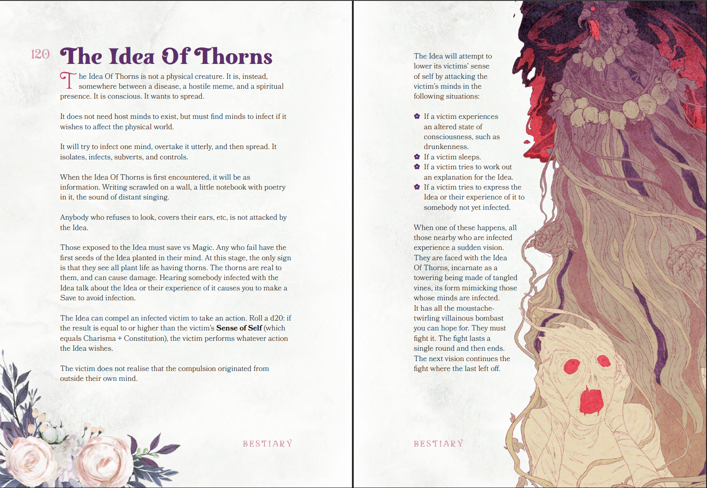
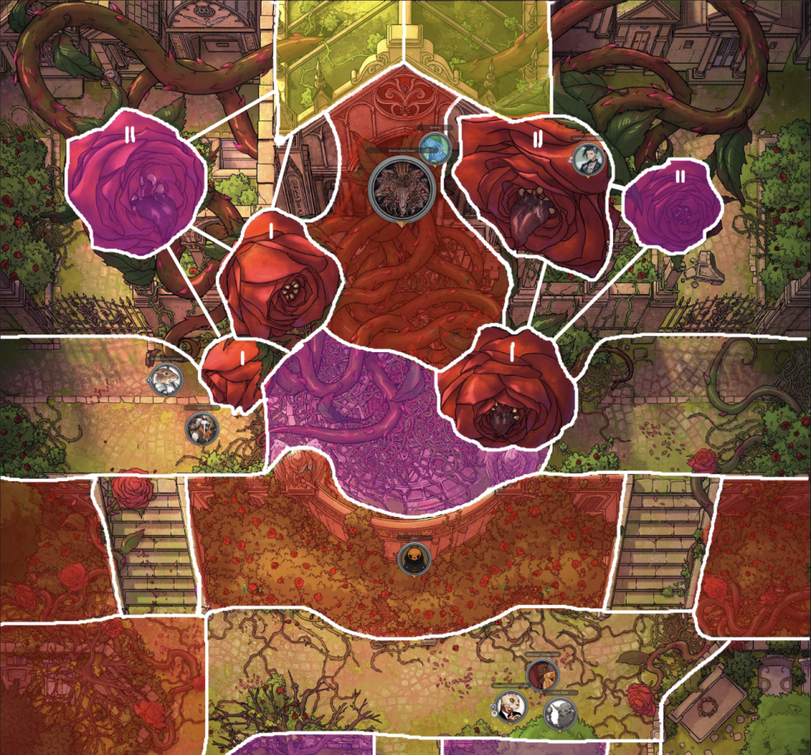
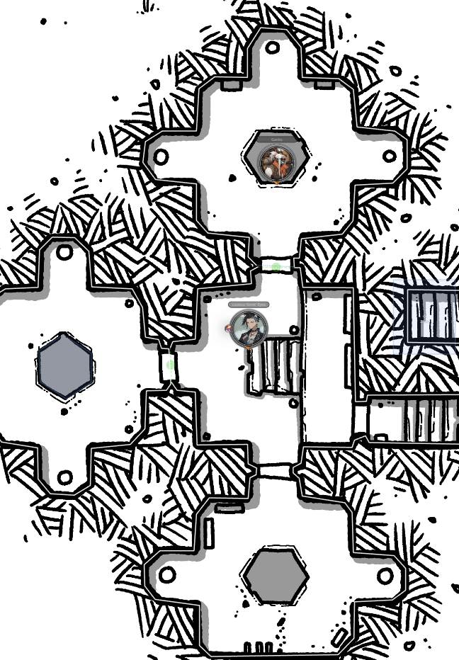

Welcome to Episode 43 of **BREAK!!: The Wandering Trio** where today the gang had a lovely tense conversation with the terror known as Skippi, solved problems via creative item use, and solved problems through bombastic item use, i.e. bombs. Overall, mostly a yap session but with really fun character dynamics between Skippi and the crew.

Along the usual conversation highlights, I also wanted to blab about the main BBEG of the campaign - the Idea of Thorns - and how they emerged organically through gameplay. Mostly for me in 10 years to simply say "how neat".

### Divine Ruler - The Idea of Thorns

Going into the campaign, I had no real notion of how long it'd go for, so I didn't plan too much in the way of epic big bads to contend with. I left it pretty open as my goals were to simultaneously explore the system BREAK!! and riff off the players, which has worked wonderfully (see [Skippi](https://its.quagg.studio/blog/posts-html/2026-04-25-session-report-42-break-we-re-sturdy-enough.html)). I at least knew the original arc was going to be attempting to calm the Water Spirits, though I did not know what form that'd eventually take.

Right as the campaign's starter quest was complete - exploring the Junkyard Junction and dealing with Skippi the (at the time) mischievous scamp - my hardcover copy of the [Gardens of Ynn](https://soulmuppetpublishing.itch.io/the-gardens-of-ynn) had arrived. And hot damn was I excited to shoehorn that straight into the campaign. The pointcrawl nature of it promised to fit well with BREAK!!'s Explore mechanics and I thought it a fun way to introduce the concept of Elsewheres. But, that was the extent of it. No intended long-standing consequences or storybeats past it being a fun 20-minute adventure, in and out.

I started placing hooks within their base hub around a figure named Elrodae inciting unrest within the dying Bazaar, claiming to have found a way to deal with the spirits *permanently*. This figure had heard tale that a piece of the Creator's Script existed within this Garden called Ynn which, when making a spirit sacrifice onto it, could erase the concept of the Spirits altogether. The truth of the matter was that Elrodae caused the Water Spirits wrath in the first place by kidnapping the Great Dragon Turtle's child. She was an Unshaped turned Elf and loathed the Spirits for having made through "unscathed". Having discovered the Bazaar held the key to opening a portal - an inert Gigaframe underneath the town - she decided to exploit the merchants' economic despair to build support for her plan and leverage their resources. When she revealed the sacrifice and her intentions, the players (who were not particularly heroic or benevolent) felt that this was all a bit "much" as a solution and had to be stopped. The bait worked, dragging them into Ynn.

Around this same time, Abra's player picked up Hocus Pox as their Rank 2 Ability and thought it fun if their mundane Bumpo was actually "teaching them horrific, eldritch magic", with the interactions visible only to Abra. I took the bit and ran with it, having read of this "Idea of Thorns" character within the Garden - a locked-away mind-infection that wants to breach the Garden's walls. Thus, Kadabra the Bumpo became the ticking bomb that eventually lead to the possession of Abra's father Taam and our present-day race towards stopping the Idea's Ascension Ritual, 30 sessions later.

Here is an illustration and bursting-with-flavor description of the Idea of Thorns in all its glory:

I made the Creator's Script rumor be entirely false, but rather a front by the Idea to bait mortals into opening the portal. To cross over into the Outer World post-Heaven's Seal, it required an artifact of itself be willingly carried by a mortal back into the Outer World. To skip over a lot, the Ynn pointcrawl was a damn blast with so much *whimsy* and horror. It ended with an awesome combat between Elrodae, a Garden entity known as the Rosehydra, and the party. Massive shout-out to [VictorSeven](https://linktr.ee/victorseventv) for statting out this fight, it being a multi-phase colossal fight with great Zone usage!

{: width="70%"}

The gang saved the water spirit child, defeated Elrodae + the Rosehydra, and crossed back over - taking with them this rather curious Thorned Seed artifact found at the base of the Cathedral. Their immediate focus, however, was reuniting the child with its parent and a long trek was dedicated to that, putting thoughts of Ynn and this artifact on the backburner. This gave me ample time to start seeding (heh) the impending reveal of the Idea breaching into the Outer World. Gack (who held the seed) started having nightmares of Ynn, curiously tangible shadows stalked them, and Kadabra's interactions with Abra were getting more frequent, more insistent on things to do.

After the triumphant calming of the Great Dragon Turtle Spirit, saving the island, I got to hit them hard with the Skippi x Kadabra x Idea reveal when they returned to the Bazaar (read the [previous post](https://its.quagg.studio/blog/posts-html/2026-04-25-session-report-42-break-we-re-sturdy-enough.html)). Seeing them connect the dots between seemingly disjointed events over the 30 sessions was a treat. An added benefit was the stakes of the situation got their complete buy-in that this adversary was a proper bastard and *the* threat to handle, to hunt down.

Not going into the motivations (revenge on mortalkind) or personality (creepy) of the Idea yet, since I just wanted to show how it came about naturally. This emergent style has worked well and has been a joy to elicit genuine emotion plus care from the players. The stakes are real for them and the pressure is off me to compel them forward.

Onto the yapping highlights.

### "By all means, shoot me if it makes you feel better!"

Having ended the session right on the reveal of Skippi within the facility's upper dome, we got immediately back into the tension. The waltz kicking on put my players into fight-or-flight and thus emotion reigned as Abra immediately threw one of his sickly mana grenades at Skippi. All knew it were futile given much of Abra's repertoire stems from the Idea's teachings. The only thing it accomplished was thoroughly ruining Skippi's picnic, eliciting a defeated "aw man, why?".

With Skippi being fully passive and noting the futility of a fight, she invited them to chat and enjoy the scraps of her picnic while she's stuck on "guard duty". Refusing the latter, they cautiously agreed and bent an ear to conversation. This was further spurred on when they recognized the portal here was being held asunder by a porcelain half-mask eerily symmetric to theirs - held aloft in mana stasis. Of this conversation, some highlights included:

- Overall very varying reactions to the information Skippi mentioned, ranging from acceptance of the tidbits (Gack) to trepidation (Lookus) to hateful denial (Abra).
- Skippi brought up their current dilemma of the Idea's intangibility, simply returning to the Garden upon defeat.
- She offered up the information she knew about these porcelain mask pieces given the research within the Facility here, along with the curious unknown origins of the wooden mask they fit over. Despite being definitively of the Garden, this wooden mask was unknown to Skippi. Given this, she had to get it in their hands before the Idea saw it.
- When probed why the hell she'd help them after initiating the Idea's breach in the first place, she retorted that she has no choice with her directions. There was fun discourse on naive mortals' failure to understand that "willpower to change one's ways" is moot when one is artificially tailormade to serve another's interests (Asura to Divine Ruler). 
- She followed this up with her selfish reasons - stating that the Idea's hivemind ascension ritual is likely to strip her of all autonomy, autonomy which she rather prefers to have. She can't do anything directly against the Idea but she's playing what angles she can...while she can.
- Finally, when questioned why they should trust any of this, she defeatedly shrugged and, as a sign of good faith, gave Gack the antidote recipe for his Jellyfied condition - soaking a clipping of the Anchor Tree's roots in Bright Water then inserting it into ones (oozy) chest cavity.
- Convo ended with the mutual recognition that they're like to fight later, and no forgiveness is to be given here.

The gang then turned their attention to the second half-mask piece, suspended in stasis and tethered to the portal. They smartly (and finally) decided to *check first* if directly grabbing the mask would be a bad idea. It would've been, with straight Injuries given out. Abra deduced this as a powerful deterrent Hex, and cleverly asked if he could leverage the Aken's Succor flower from below (which nullifies Magical Abilities as its imbuing power) alongside some Gobbowerks to make a one-time Mana-Dampening Spray.... and of course he could, that's a sick combination of item and ability.

Satisfied with the information gleaned and all porcelain mask pieces retrieved (and after a failed attempt to simply stick them together to 'activate the magic'), they begun to head out. Abra, in one last act of defiance, set a Mana Bomb in front of the portal to destroy the Anchor Tree. Skippi agreed to be part of the blast if it'd make him feel better. She merrily went back to Ynn while munching on the scraps of a bear claw.

Gack used his oozy form one last time to get the clippings of the Anchor Roots. To access the roots directly, submerged in a tube of the same toxic ooze polluting the jungle beyond, Gack had to open the tube's hatch and fully ooze up the chamber. This was all well and fine for Gack given his oozy-state. However, the root clipping was a solid object which meant Gack could not use the classic wall-trick to leave this chamber. As such, the chamber doors had to open. Instead of warning the unsuspecting Lookus on the other side, Gack just opened the flood gates and a pressurized wall of ooze shot forth - causing Lookus to take a Serious Burn injury when he failed to dodge in time.

{: width="35%"}

Good laughs abound, they fled the now-flooding Facility and went surface-side. There, they reconvened with Dirt and the forever-unnamed Goblin Guide, who were both found smoking on some heavily hallucinogenic substance. The Guide sat perfectly fine stating it is for his health while Dirt was going through something of an ego death, expansive galactic voids present within his eyes. When offered, Abra took the bait and failed his Grit Check to withstand any symptoms. I've wanted to use the [Odditis](https://breakrpg.blogspot.com/2024/11/freebie-arcane-contamination-syndrom.html) table for some time! Unfortunately, for all of our imaginations, Abra rolled for Stretch Sickness which disproportionately elongates one's limbs for the week. It has not been said thus far in the session reports, but Abra *already* has uncomfortably elongated limbs for a Goblin; that was his Ynnian Alteration (read: mutation) during their adventure there. So, then, what should naturally be a 3ft Goblin became a 4.5ft Goblin, and is now nearly a 6ft tall Goblin. This "little" rat damn near looks like [Wilt](https://external-content.duckduckgo.com/iu/?u=https%3A%2F%2Fi.pinimg.com%2Foriginals%2F38%2F46%2Fe9%2F3846e9d55a8f8984ae71eab3d696ee67.jpg&f=1&nofb=1&ipt=cb0ec1420ff6d39b6b794721bfe84f6f7ca979e9554f2dca86ec24b0e1cc9f93) from Foster's Home for Imaginary Friends now.

We ended the session off by them kicking back out into the Grove, heading off towards the swamp goblins of the Half-Knowing Den in search of hints on the masks and rumors of some coveted teleportation rings keyed to the island. The gang decided to have Dirt scout for them the day after his ego died. Instead of flying like the Skree he is, he simply walked on two stubby legs into the jungle ahead of them, devoid of any care for life. A successful Insight check but a failed Deftness led to a very funny ending scene. 
> "Dirt tiredly walks out of the jungle towards you all, sighing with: 'Hey guys, not that it really matters given nothing does, but I did alert a bunch of those scary Rosehound things. They're, ah, right behind me about to pounce.'"
 
A lovely *"Wait Dirt, what the fu-"* was all that capped the session. Hope you enjoyed the rambles, thanks for reading!
