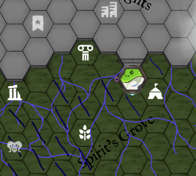

Been a bit, a whole whopping 2 weeks. Most of my creative writing energy last week was consumed by describing the [Den of the Half-Knowing Ones](https://its.quagg.studio/blog/posts-html/2026-05-14-den-of-the-half-knowing-ones-settlement.html), which I'm very happy with, and the session followed the beats closely enough that I've decided to combine today's session report with last week's. There are no rules here!

So without further ado, here's yapping on Episode 44 then 45 with some Adventure Site Exploration rule updates.

### Episode 44 - [How Not to Drown](https://www.youtube.com/watch?v=7U_LhzgwJ4U)

We ended last session with the gang en route to the Den of the Half-Knowing Ones, a group of swampy goblins who might hold some information on their strange Gleysian-Ynn combo mask - key to making the Idea defeatable in the Outer World. The very last bit, however, was their ego-dead scout Dirt stepping out of the woods with:

> "Dirt tiredly walks out of the jungle towards you all, sighing with: 'Hey guys, not that it really matters given nothing does, but I did alert a bunch of those scary Rosehound things. They're, ah, right behind me about to pounce.'"

As the party managed to only blurt out *"Wait Dirt, what the fu-"*, combat began! Here I'd like to say *"and pounce the Rosehounds did"* however, despite throwing 7x Rank 6 Bosses at the party, they wiped the jungle floor with them. Shadow Puppets, Mana Crushes, and Arc Weapon x Spirited Slaughter made light work of them.

 pond. Map by [Czepeku](https://www.czepeku.com/fantasy/maps/overgrown-magic-forest/deep-pond-camp-day)."){: width="65%"}

The one thing the enemies managed to do was once again break Lookus's leg (counter says 8th time) and throw him over a pool of water...a pond that endlessly pulls you under. This mechanic was a spontaneous one given I grabbed a random Czepeku map with the feature but it became a rather core one to the fight. They had noted the weirdness of the water leading into the fight and saw firsthand one of the Rosehounds get sucked under so the party went on high-ass alert when Lookus failed his Might Check and got pulled under. Gack dove straight in without consulting Abra and started drowning as well.

I had no real intentions of making it a lethal trap...until they were in there, panicking about it. To rectify this, Abra has a legendary artifact (read below) from the Water Spirit of Season 1 which allowed him to pull Lookus out of the water easily. Lookus then, after 35 sessions of having this item, finally realized that he had it equipped. They are gloves from a creepy mime they fought way back when and allows one to make an imaginary lasso or, in this case, an imaginary fishing rod. So despite their insane rolls, it was still an engaging fun fight on the water alone.

:::item
name: Naryu's Sapphire
type: Artifact
desc: An stunning ever-shimmering sapphire-like ring that appears to ripple like the waves itself. It is said to be a tear cast off the Divine Beast Naryu, a great spirit of nature who works quiet and contentedly on the great seas, as they always have.
effect: Imbued with immense amounts of Twilight Mana, this artifact seemingly charges itself passively simply by collecting the moisture in the air around it. This Artifact contains 3 Abilities, which recharges at varying intervals.
- **Naryu's Love:** Once per Fight, as an Action, you may become water itself. Any Attacks or Abilities that target you are negated until the beginning of your next Turn. Does not negate Battlefield Area Conditions.
- **Naryu's Embrace:** Once per Day, as an Action, you may surround a Creature other than yourself with a tempest of water that negates all Damage, and pulls them to your Battlefield Area. This may be used on another Creature's Turn before their Action resolves.
- Credit to VictorSeven, adapted from his LoZ BREAK!! Homebrew.
stats: .1 Slot . ???
:::

:::item
name: Mime's White Gloves
type: Magical Gloves
desc: Though a mime's movements are exaggerated and make-believe, the effects of their tricks are very much real.
effect:
- Once per Day, the one wearing these gloves can use the **Imaginary Lasso** Ability on a successful Aura Check. 
  - On a Failure, they couldn't mime well enough to invoke the magic.
- **Ability - Imaginary Lasso:**
  - As an Action, the User can pretend to throw a lasso around a Target up to 2 Areas away.
  - Requires a Might Check or the Target is Restrained and dragged to the same Area as the User.
stats: 1 Slot (carried) . 150 Coins
:::

One Healing Hands later from Gack and the gang was back on their feet, literally. The rest of the travel to the Den was simple, on account of me not bothering to roll anything more. I won't go into much detail on the Den itself or what its business is (given I did so at length here) but I wanted to talk player reaction to it.

Nothing butters my yam more than hearing the awestruck reaction of players when I describe a fantastical scene and put up artwork to accompany it, especially when you hear their brain cogs churning at what connections there are to existing threads. Something about BREAK!!'s working kitchensink of themes and ideas makes it so even if you're constantly putting novel things in front of them, it all feels like it makes sense within the world. It feels like you have to do less boilerplate, contrastive work (i.e., mundane life vs. wacky external thing) to invoke that deep sense of "exploration awe" when everyone's just living their best lives in a wacky sundered world.

On the brain cogs churning, Lookus immediately noted the fractal patterns of the stone and how everything connects together, asking Abra if this is some "gobbowerks bullshit." Abra got defensive, as is his natural inclination, but took a proper look and confirmed that this was the single greatest work of gobbowerks he's ever seen. Both of them started spitballing lore theories, and it was great to see.

"){: width="50%"}

Regardless, they followed the Den's storybeats pretty on-point, interacting with the Great Computer's vice lead architect Sprick and exploring their conundrum of the Computer giving the "wrong outputs". It kept saying that no one should bother doing anything, not even itself, given it was the "end of all times". The Party, knowing the world's situation, was able to confirm that this was actually the *right* answer, and that their great work was correct. Satisfied, all of the Den's goblins immediately gave up work to start planning an "End Of Times Festival" to go out with a bang.

The gang did get some information on the Mask, however:

- It was indeed of Gleysian make, and made out of a similar-yet-better material to the Great Computer - that of Refined Vain Stone. This Lightning-Mana infused stone can carry computational runes to enable computing devices.
- The reason it does nothing when placed on its wooden counterpart is simply due to it being markedly out of power. Sprick suggested that they find some pure, untampered Gleysian power source to recharge it...wherever one is.
- Its computational runes seem to contain the "anti-thesis of an Idea" by recursively computing Thoughts on the Idea until it finds the Idea's most natural Ending. All that pretty prose to say: "it'll work to bind the Idea in physical form."

:::item
name: Vain Stone
type: Magic Stone
desc: Stone so vain that geologists swear different deposits fight to be the most presentable.
effect:
- A form of stone which repels all other types of stone or metals from itself. 
- Naturally lightning-aspected, it is immensely useful to all manner of Gadgeteering work.
- Concept [modified] by: Ekulio
stats: 1 Slot . 150 Coins
:::

To end the session, Sprick, the vice lead architect, approached and asked the Party if they could investigate their missing mining expedition at the base of the Celestial Heights cliff up north a bit. They had run their current Vain Stone deposit dry and are in search of a new one. This specific expedition contained the Lead Architect Spruck but they never returned back, so everyone presumed it a "doomed" expedition. Sprick doesn't care about the state of Spruck but is missing his Star Gem and suspects that Spruck stole it from him. It'd give Sprick no greater joy to oust Spruck of their "true nature" and take their place as Lead Architect himself.

The party said hell yeah to the drama of ruining someone's reputation and figured that, if it is indeed a Vain Stone deposit, they might find some useful leads on the source of the mask's construction or ancient material refineries.

### Episode 45 - Gobbos Yearn for the Mines

Coming back to the session, they were made aware that they arrived at the village at the end of their day's travel and thus must rest (or rush against Fatigue) and rest they did. In this lovely high-techy yet druidy village, they asked Sprick if they could kick it here for the night. It being the absolute end of times, Sprick said that while there were no public lodgings in the village, they could rest in his house while preparatory work on the festival begins.

The unnamed Goblin Guide claimed to know which one was Sprick's house so they could just follow him ||(more 'who knows if it's true' backstory to keep 'em on their toes)||. Regardless of whether the house the Guide arrived at was truly Sprick's, he had a key to it and let them all in. Unlike the relatively ok-technology of the other villages on the isle, which are normally just scraps of whatever Gleysian tech they could salvage, the houses here were *well-appointed* in comparison. Everything made of Vain Stone and the computational runes, maybe-Sprick's house contained a working fridge, Lightning-Mana stove, you name it. In true hero fashion, the party raided the fridge, ate everything, and chilled for the night.

Gack's camping activity was spent trying to sell complimentary limb replacement surgery to Gobbos passing by on the street. (Sidebar: there have been a surprising number of Drone arm replacements for NPCs in the campaign thus far, all benevolent, but it is nuts because they only fought Drones once in Episode 4.) Gack succeeded in getting the attention of one person walking by, a runecarver who has lost their mind after weeks of the failing Computer. Putting pressure on Gack is fun and thus I had this Goblin ask very leading questions about the extent of the surgery, i.e. "if I cut off my head, could you replace that?", in an increasingly aggressive fashion. And said Goblin did just that when Gack eventually cracked and gave the slightest uncertain hint that it could be possible.

Thus far in the campaign Gack has been an absolutely stellar healer and surgeon, operating in rather stressful situations. However, on this occasion, he absolutely biffed it with a Critical Failure on the roll. The normally unwavering, confident, bullshitting personality of Gack froze in that moment and he did nothing but sputter out a pathetic eulogy on the spot rather than attempt the surgery. The village tabloids when they awoke later warned of a "Limb Replacement Grifter" going through town and as such, Gack gained a Negative Reputation in the village.

They then waltzed out into the jungle once more in search of the mining expedition, seeing the festival's banners strung up high and impromptu stages being gobbowerksed up on their way out. The journey to it was very peaceful. The Guide actually managed to fail a Trailblazing roll despite an Insight of 18 but, with only A Few Missteps, all was fine.

{: width="50%"}

I won't go into crazy detail about the lore of the mine and its whole schtick just yet as I am essentially playtesting the "They Dug Too Deep" adventure adaptation from my [book of one-shots](https://its.quagg.studio/the-helical-expeditions/helical-expeditions-book.html), originally from [Moira Games](https://moira-games.itch.io/they-dug-too-deep). It's amazing — go check their stuff out. The plan is for the mine to have stumbled across the old hidden laboratory of a High Calian Fleshwarper...who messed up their very final experiment. The lab will contain the Rings of Fleshwarping Teleportation they're on the lookout for. It is time they got a faster mode of transportation than boats and walking!

To condense, here are a few highlights of the few rooms they got through thus far:

- Gack baited Abra to use his once-per-day Mana Bomb as the means to open up the collapsed mine entrance, by means of "yeah well I doubt your bomb could handle *that*".
- They immediately found the body of Spruck within, having been the one to seal the entrance. No Star Gem on the body but tropey notes about "finding a breakthrough".
- Despite numerous warnings that the mine elevator was rusty/creaky, they all crammed into it and snapped the tether. Falling Injuries ensued but they all got lucky.
- Gack tried giving a peace prayer to the deceased miners within the first chamber but took a wicked claw to the face as their Blighted Demon forms rose up and attacked!
- Cautious Movement made their day as they discovered the secret door hiding treasures of *ancient* beer bottles.

Here is the Adventure Site map and where they got to:

.")

### Conclusion

I mentioned a few [posts](https://its.quagg.studio/blog/posts-html/2026-04-16-session-report-41-break-not-more-plants.html) back that the Exploration rules have always scared me to run and I wasn't sure how it all fits narratively/with my GM style. Some stuff has definitely started to click for me and the group on this second go, I'm happy to say! Markedly, I discovered the rule that the party all gets "1 Turn's worth of Actions" before Location Actions kick in. How I missed this having read the section many times is a mystery, but ah, here we are finally.

Regardless, this was the component that made it all click more. I had been trying to reconcile how Cautious Movement slots in against Inspect/Linger actions. Since Cautious Movement discovers everything automatically (at face value), Inspect becomes obsolete for this movement type, and thus you'd *have* to always Linger to interact with a room at all and be harried by 2 Wandering Encounter Rolls. It seemed like an unnecessary halt to narrative/forward momentum to step back into mechanic-world right after combat to declare Location Action/make encounter rolls.

But that Turn's worth of Actions buffers a ton here and opens up a much more natural flow in players interacting with the space. And specifically, for Cautious Movement, *now* you can sweep up all the easy, already discovered interactions and simply Move on without a Wandering Encounter, only having to Linger if there is a longer interaction to deal with.

All-in-all, it is funny to me that [START](https://www.kickstarter.com/projects/greywizard/start-a-break-rpg-zine-01) (kickstarting now!) will be such a useful tool in helping me solidify the Exploration rules at a game flow level despite 45 sessions of this campaign, a previous 10-session campaign, numerous one-shots, and variety of homebrew :^) Have I got the right of it yet? Don't think so but vibes are good and the game is going well.

As always, thank you for reading the ramblings!
