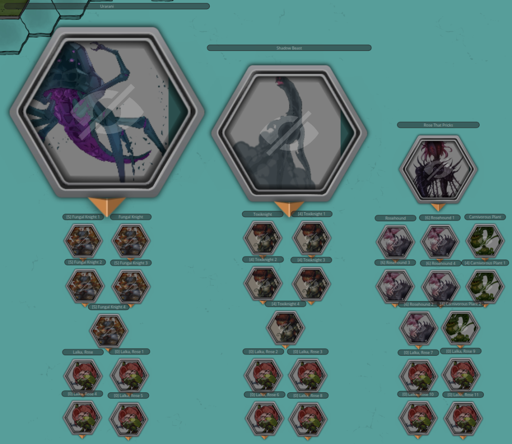
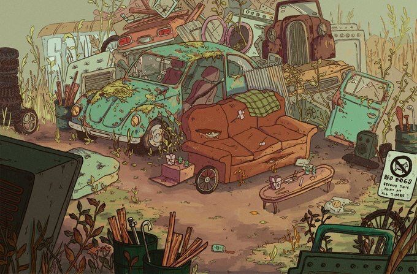

In this Episode 49 of **BREAK!!: The Wandering Trio**, the gang locks the hell in after island-ending stakes are established in concrete mechanical terms...and puts the weight of the island onto the shoulders of their small talking moth Dirt.

Previous report [here](https://its.quagg.studio/blog/posts-html/2026-06-27-session-report-48-break-a-fairy-tale-exit.html). To the report!

### The Stakes

We left the previous session with the gang leaving the Adventure Site on the backs of befriended Water Chompas through a hidden river exit. They were taken to a riverbank prior to the water becoming too toxic (on account of the, now disabled, [Botanical Consortium](https://its.quagg.studio/blog/posts-html/2026-04-23-the-botanical-consortium-adventure-site.html) nearby).

As they were about to Camp, deciding to pick up Dirt and the unnamed Guide outside the mine's entrance after their rest, I damn near curtly asked if they would like to become aware of the hidden mechanic that has been running in the background for some time now - now or after they return to the Den. Sudden trepidation to even Camp, they made the wise decision to be informed. As such, I got to do the big Hoard reveal and describe the Barrier Die.

As stated previously, the gang had wanted to "make a stand" at the Evergrove to defend Elix once the Barrier falls - their thought process being "well if our enemy can just teleport in shadows, we may as well wait where their last target is." I dug that, and agreed. Thus, I hinted at a "long-running hidden mechanic" (at the time a lie, but shush) that has been going ever since Elix put the Barrier around the Evergrove up; that being right after the movement of the Idea of Thorns on the Outer World. Simply put, for every Day that passes, I have rolled a decaying Resource die. Standard in other systems, the mechanic is where the die starts at some tier (i.e., a d20) and on a roll of 1, it lowers one tier (e.g., d20 -> d12 -> d10 ...). Once a 1 on a 1d4 has been rolled, in 1 Day's time, the Barrier will fall and the Hoard will descend on the Evergrove. Here is the Hoard, an absolutely insane cumulative Rank nearing 100, and one they have no chance of abating alone:

{: width="75%"}

The gang, realizing that the Urarani that they had quite a tough time taking down by itself was but one of *3* Mega-Bosses present here, actually took the threat into serious consideration. I described to them that this mechanic is quite literally out of my hands for *when* the Barrier falls and it is up to them to figure out priorities as time passes. So overall, depending on their wit and luck, they might either strengthen the Barrier in time (setting the Idea's plan back quite a bit), have to defend it, or arrive back too late with a taken Elix. I like this because it vastly affects their preparation for the final arc, i.e., whether they'll have a buffer to plan and prep or simply have to rush ahead to prevent the Ascension Ritual.

Being very transparent about these stakes was not only a "healthy GM" thing to have done here (instead of rugpulling them with the Barrier) but it also caused them to **lock in** more than I have seen thus far into the campaign. They all immediately started brainstorming how to deal with the threat, whether they should split up to attend different aims, and all manner of other things. It gave me great joy to see the stakes settle in as much as they did.

### Dirt...the Island's Fate Falls on You

Upon meeting back up with Dirt and the unnamed Goblin Guide at the mine's entrance, I gave them a gentle nudge that Dirt - Gack's Boon Companion - flies like a fighter jet (Very Fast Speed) and can speak Low Speech. With the long-awaited realization the potential Dirt has for island-wide communication, they set to work concocting a flight trajectory to call on allies and factions, far and wide across the isle, to come to their aid. This will be a rather high-level rundown of like 40 Episodes of factions and lore that we haven't covered, nor will I cover in much, much depth here. It is what it is. Anyways, here is a map of Skyray Isle shittily annotated with the factions we'll discuss:

Closest to their current location, and the most important, is **Skykite Valley** - a cobble of tinkerers that live in stone-set recesses of large ground fissures atop the Celestials' Heights, focusing on building insanely fast air-skippers for their annual Death-Run - a race through the hot-air fissures. The gang helped a young underdog named Zephyr there, won the race, and cleared out the Grim Wing that keep them stuck in the fissures for an Aeon. Oh, and Dirt was the race's cameraman/announcer. Art of it:

"){: width="75%"}

They are the most important as 1) Lookus is down bad missing his failed love interest and 2) the fact that they might be able to construct actual *sky*ships to ferry other factions quickly across the isle. Following the fall of the Grim Wing and the trio's departure from there, I'd like to think the tinkerers have already started experimenting with actual skybound contraptions, safely exploring the surface finally after all this time. Given the party's infamy here, Skykite will pool its resources towards this cause no questions asked and build up some skyships of transport and of war.

Following this, Dirt shall head back to their home - the **Celestial Bazaar** - to attempt to stop a board meeting from occurring, as Lookus won't be able to make it in time. The Bazaar consists of a Merchants' Coalition that, at one point, was the beating heart of the Isle's commerce, taking the unearthed Gleysian relics from within the island and selling it off to buyers the Twilight Meridian wide. After the Water Spirits shut down all seafaring and the island's trade died, they went into a state of stagnancy, giving up and just getting by. Art of its hay days:

"){: width="75%"}

A Skele-master the gang befriend many, many sessions ago, Dave, had made a trade-agreement with Lookus (as a representative of the Bazaar's Yakuza) to fix up the crumbled road infrastructure around the island, hopefully revitalizing island connectivity. All of this is to say, Dave is holding a board meeting there in 6 Days with the Merchants' Coalition to solidify the agreement's terms and direction going forward. Dave is a sly bastard and will absolutely manipulate the terms to further his true ends - something something becoming a Skele-Monarch - if Lookus isn't present.

This stop isn't *really* about gathering allies to the defense of Elix given they're mainly merchants and Lookus just needs a time buffer but he did play to Dave's ambitions by saying there might be plenty of souls to harvest at the Barrier if Dave is willing to send his budding Skelemen army. This one will be a Negotiation on behalf of Dirt, so ah, we'll see.

Next up to the North are the Goblins of the **Junkyard Junction**, formerly(?) led by one of the old Isle's Saviors named Glimwick. This was actually the first Adventure location of the campaign, in which the party travelled here to figure out the cause of delayed shipments from Glimwick to Taam. They had a great big Adventure Site exploration here, met a hated adversary by the name of Gill-Z (sentient small goldfish in a power suit), and had a great big Mech fight. Overall, a lovely beginning arc of whimsy and gobbowerks and junk galore. I don't have a picture of this place as it was AI at the time but just imagine a gorgeous and massive fortress of welded-together junk and scrap where if you can find a place to weld a home onto the heap, then a home is yours. Instead, have a Camping spot the party used in the Site:

{: width="75%"}

From the Junkyard, it is those very Mechs of which the players are interested in recommissioning. They figured if Glimwick was likely already abducted by the Idea, then the high-strung Goblins of the Junkyard will have no use of the mechs and be likely willing to join if it means getting their boss back. No Negotiation here either, they left on great terms and the Goblins have a personal investment. The plan is for Skykite Valley's fleet to fly here, scoop up the Mechs and Gobbos, then head to the Barrier. Kinda hoping the players are at the Barrier when the fleet arrives as I think that'll be a sweet ass visual to narrate - Junkyard Mechs carried by ropes on skyships.

Following the Junkyard, the next demands of poor Dirt (who will be flying full speed for multiple days straight) range from less certain to ones more out there. They're interested in checking on how the **Yakuza** are doing in their turf war against the Cliffshadow Syndicate to the northwest near the Witch Bog, and seeing if Anubis (clan leader, one of the Isle's Saviors, etc.) is as yet uncaptured by the Idea. Surprise, surprise on the state of that one.

After that, Dirt shall head to Delfino's Plaza, the forest plateau on the western side, to entreat with the Great Mushmin Houses of Tachonis and Eisenfasen. These Great Houses are locked in political conflict and strife as House Tachonis betrayed the House Davinos, wiping them out, and a resistance is rising from House Royce against them. Astute readers may ask - was this just ripped straight from Critical Role's Campaign 4? Why yes, yes it is. As part of a random Mushmin encounter while on their boat ride south, I spiced it up by going on a monologue from a regiment of Mushmin about the political strife occurring within the beautiful, serene forests behind them. The players, not knowing the source, were enthralled by their plight and damn near abandoned their quest to check out the forests. Remembering the Mushmin fondly, they told Dirt to beseech the surviving Great Houses to lend their aid at the Barrier - requiring a Negotiation Check per House. Tachonis will be at a Snag as they'll absolutely move to crush the other Houses if they lend their aid and leave themselves vulnerable.

"){: width="50%"}

And the final stop is Jerryland, the very first village I ran on Skyray Isle in a short-lived campaign just before this current one. For context, Jerryland was once called Dragon's Roost Port and was the rundown ruins of an *old* port town. Those PCs were sent by the Sol Alliance to investigate the island and set up a base of operations but of course the Water Spirits crashlanded them, setting up a bit of a survival/base-building campaign frame.

The PC concepts were great, NPC interactions were amazing, and vibes were good - it was ust a matter of scheduling. However, the current campaign and its players have gotten to interact with the denizens of the port town that is now on its way to greatness, reluctantly led by the skeleman Mayor Jerry. The whole town but the PCs and their exploration crew are chill Skelemen who had their mean Skelemaster boss cut down by the party, and threw their lot in with them. Regardless, Abra's player specifically asked Dirt for this because he wants his character in that campaign to make an appearance. It'll be a Negotiation because we both know his character would need convincing, no free lunch bucko.

"){: width="50%"}

And with that, the Great Flight of Dirt over Skyray Isle was finalized. Given the stakes here, it was really cool to see the players scrounge up their knowledge of the campaign and factions to build out a tiered plan of feasibility. It's quite good and, unless we roll only ones from here on out, they're pretty safe to have the support of Skykite and the Junkyard at the Barrier - which is much needed.

### The Gleysian Mask of Tangibility, Powered

Satisfied with their plan, they bid Dirt a fair journey with a simple head nod before he took off at Mach-10, ascending the Celestials' Heights into the clouds above. Feeling the pressure of a ticking clock, instead of Resting after their horrible day in the Adventure Site, they actually decided to Rush through to the [Den of the Half-Knowing Ones](https://its.quagg.studio/blog/posts-html/2026-05-14-den-of-the-half-knowing-ones-settlement.html).

They had originally left to get Sprick, Vice Lead Architect of the Great Computer,'s Star Gem off the dead hands of Spruck, Lead Architect, and had left the village abuzz with the news that the world was ending. Instead of despair, the Swamp Goblins decided to start prepping an End of Days Calamity Celebration with the comforting knowledge that their Great Computer was indeed predicting correctly all along. Only but a few days since their departure, the gang returned to see the whole village transformed into a grand, raucous festival - street vendors galore, a massive concert stage built around the Central Obelisk, a grunge band, banners, drinks, drugs, the whole works.

Finding Sprick in the crowd, they reunited him with the Star Gem and told him of the fate of Spruck, fulfilling his lifelong goal of becoming the Lead Architect and stomping on the reputation of Spruck - even post-death. As a reward, Sprick offered the gem up to the party since he has no need of it after the public ousting. Lookus, even in the mines, had the brilliant idea that the Star Gem seemed sufficiently powerful to act as a source of power to recharge their inert Gleysian Mask of Tangibility, and had wanted to consult the Swamp Goblins on the feasibility of it.

Putting the thought into the air Sprick, in a drug and euphoria-induced frenzy, went off about the mechanics required to do this - building a Mana Source Converter from Bright to Lightning, requiring rewiring the Obelisk's computational runes to match the Mask's, etc - and started sweating profusely. Gathering up a coalition of engineers to the Obelisk, still mid-concert, they began their frenzied "we have 10 minutes left in this hackathon guys" work, occasional Lightning Mana arcing off a circuit and the curse of an engineer.

I had them roll a group Insight Check, needing 2 of 3 Successes, to see if this plan worked. On a Success and a Critical Success, I got to describe a lovely scene on the brilliant intersection of a true mastered Gobbowerks and flawless Gleysian engineering, creating a technicolor laser light show as computational runes sung out and Lightning Mana crackled wildly. With that, the Gleysian Mask of Tangibility was finally recharged to full strength and capable of making these damned creatures of Ynn killable, permanently. All players agreed that the sheer beauty of this display alone caused them and many of the concert-going Goblins to faint on the spot; the gang for the whole day to recover their Fatigue. And there we ended!

Homework:

1. Figure out the player's next intentions and prep accordingly. There was mention of going on the offensive now to the individual hoard groups, now that the Mask is recharged, while Dirt is off on his Great Flight.
2. Stat out the Mask properly and give it as an item.

Lot of old campaign lore information here, which was fun to recount. Thanks for reading!
