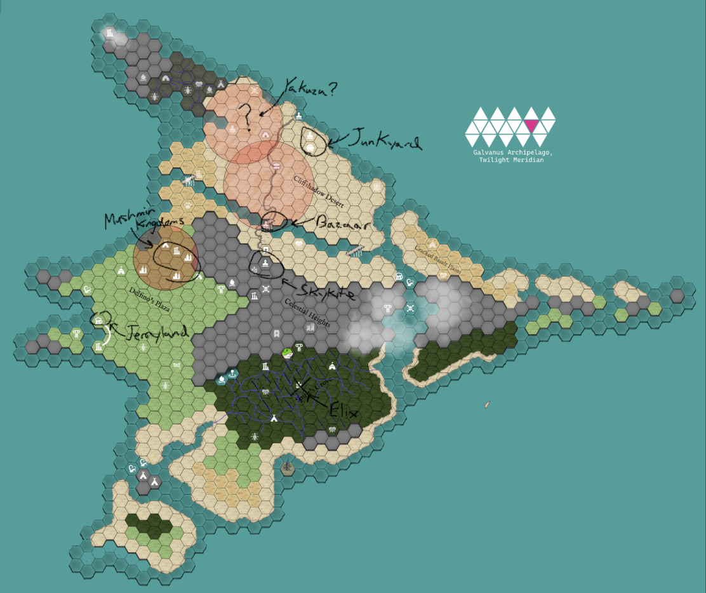

Been a bit! On this very special 50th episode of **BREAK!!: The Wandering Trio**, the gang sets off again into the Spirits' Grove with bolstered determination, a Mask of Tangibility in hand. As their footfalls press into the dank soil of the jungle, high above a moth flies at Mach-10...

Despite the *momentous* number, the session was actually pretty short and sweet just due to time constraints for the week. The significance doesn't come from any particular storybeat or accomplishment within it, though that'd have been neat to line up, but rather a shared group feeling of "wow, 50 sessions is a decently long campaign". Having been able to take a campaign from humble Rank 1 beginnings to now nearly Rank 10 and a finale arc in sight is a treat, and something I feel not many GMs get to do due to the bastard of scheduling and time. Enough reminiscing (gloating?)!

Last report laid out the arc's mechanics and stakes - namely "defend Elix in the Evergrove" - so go study up [here](https://its.quagg.studio/blog/posts-html/2026-07-11-session-report-49-break-it-takes-an-island.html).

### The Morning After

Last session ended on a high note with the Gleysian Mask of Tangibility finally restored to working order in a technicolor show of electric sparks and light as the Den's Great Computer broke a Star Gem down into Lightning Mana and infused the mask. With a Critical Success on how well Sprick's Gobbowerksing worked to perform such a feat, the Fatigued party (and many, *many* of the Goblins in the audience nearby) fainted, struck with awe. Having slept deeply to cure their Fatigue, the party awoke to find themselves still on the festival's concert stage, groaning to the blaring music which has played non-stop during this End of Days Calamity Festival.

They quickly gathered their wits and set back to the task of preparing for the rush of Ynn's Hoard upon the Barrier's Fall. Finding Sprick and his engineers groggily waking up nearby, the gang coralled them together. The players had thought that these engineers would be a great resource to have at the Barrier to potentially figure out a means of strengthening the Barrier's Mana or militarize Evergrove's defenses. A successful Negotiation got the engineers onboard with the stipulation that they'd need 2 Days to regain their wits before heading on over. With this being the End of Days Calamity Festival, most everyone in the Den has busted out their strongest or most inventive drugs to imbibe.

Roost was somehow brought up in conversation with the engineers and Sprick remarked that, despite how stiff the monks are, their Spirit Brew is damn good. They all similarly lamented that they hadn't had it for quite some time due to the Jungle's corruption. This led to a wholly unintended interaction where Abra noted that he actually had 2 Barrels' worth of the stuff (2 Trade Goods) that he had bought while passing through there 10 Sessions back. Stunned (me and the goblins), they overpaid a bit on the goods given supply and demand so Abra walked away 2 Gems richer. This interaction, however, brought on an additional stipulation from the engineers that they would thusly require 1 additional Day of regaining their wits. Fate of the world be damned, 2 Gems is 2 Gems.

With affairs settled in town, they decided their best course of action was to reconvene with Elix to discuss the Mask and where things stand before either 1) heading to Roost and seeing if their scout parties have additional intel on the Blightheart Dens or 2) just blindly heading into one of the Dens with no plan. Let's be real, it is probably Option 2 and I'm likely to just prep that, improv'ing Roost if need be.

We only got one day of consequence-free Travel and Camping in for the session. I gotta say, though, the Barrier Die mechanic is working quite well to ratchet tension up. Making them roll the die refocuses attention at a good interval and you can feel their stress when they roll close to a 1 (i.e., the decay threshold).

During the Camping Activities of that night, Lookus decided to simply sleep. Abra, in a rare moment of social warmth, decided to attempt to Socialize with Gack over how Abra truly understands how Gack must feel with Dirt out on his own in the world. One Critical Success later and Gack's bravado melted away into the true anxiety and loneliness hiding underneath. To help, Abra offered to let Gack take his usual cuddle spot next to Kadabra overnight. All-in-all a cute moment...until they decided to lean into childish instincts and attempt to prank the sleeping Lookus by putting his hand in hot water. I truly hate to write this but, unfortunately, Lookus failed the subsequent Grit Check.

### Rallying of the Kites

With that hopefully forgotten, we segued off into the clouds high, high above...over the Celestial Heights where one brave moth soars onward, future of the island on his shoulders.

As detailed well in the previous post, Dirt was sent on a grand circuit around Skyray Isle in the hopes of rallying all their allies and forces to help defend the Barrier. I had originally thought to make this a hidden mechanic where the players would find out who agreed to go and made it by the time the Barrier fell, but upon reflection, it seemed like the perfect opportunity for elucidating the effect of the characters on the island in a way they wouldn't be able to see otherwise in the remainder of the campaign. As such, for this arc of preparing for the Hoard of Ynn, we'll be having cutaway scenes that follow the adventures of Dirt and the changed lives of those they've impacted during their travels.

Here is the annotated map of Skyray Factions, with more information in the prior post:

Just a day away from the party's position in the Spirits' Grove, beneath the oppressive cliff heights, Dirt was able to scale the Heights and quickly reach Skykite Valley.

"){: width="75%"}

**Skykite Valley** is a cobble of tinkerers that live in stone-set recesses of large ground fissures atop the Celestials' Heights, focusing on building insanely fast air-skippers for their annual Death-Run - a race through the hot-air fissures. They live in the fissures and avoid the surface because the terrifying Grim Wing once scoured their lands, stealing away anyone caught in the open. While traveling through these lands, the party actually slew the Grim Wing (...after a Chosen One fought it first, weakened it, and then died to it...), freeing the land from its tyranny.

As such, Dirt came down from the clouds to a very different visual of Skykite Valley. Topside now liberated, the tinkerers of Skykite have begun pouring out to explore their surroundings - the woodlands, the other fissures, and jagged peaks strewn about. Early experiments with building full-flight skyships were already underway; skyships that could sustain themselves airborne off Spell Engines or thermals rather than the limited hot air of the fissures. It was a very different visual from the first time the party arrived to Skykite and I believe it gave a good feeling of the world reacting and changing from their efforts.

On top of that, to drive the point home, I got to detail the new life of an old Guide GMC they traveled with for some time during this arc. When hunting the Grim Wing, they needed a Guide and bullied some drunken no-life in Skykite to act as one for them. Throughout the Journey, it turned out that this fellow named Zey was once a world-renowned traveler but fell on hard times and despair. After their successful adventure together and reigniting some passion, Zey has managed to dedicate himself to being the local Guide of Skykite Valley. He has significant knowledge of the Celestial Heights, having often risked encounters with the Grim Wing during its reign, and has been reintroducing the citizens to their local area.

Regardless, Dirt is on a mission and sought to it. He immediately beelined for Zephyr, the young underdog tinkerer the party helped win the Death-Run and asked for help wrangling up the village. Already a celebrity due to his involvement as the cameraman *and* commentator of the past Death-Run, Dirt sat the engineers of Skykite down and busted out a very serious, very strict slide deck that detailed the situation on the Island and in the Outer World with respect to the Idea of Thorns and Ynn. Flight charts were drafted up and instructions were given that the tinkerers were to ready their full-blown skyships to make way to the Junkyard Junction and ferry the Goblin Mechs to the Barrier.

Given the party's well-earned reputation in Skykite - having directly won the Death-Run and cleared out their Grim Wing problem - no Negotiation was needed here and we got to kick off the timelapse of the engineers getting to work as the camera panned cloudward once more.

Overall, we all really liked this style of cutting between their efforts and Dirt's, and I am excited to continue the trend over the next few sessions. It is sort of a weird/interesting preparation period of the campaign given the Barrier Die and none of us knowing how that will unfold, but it is a great lull before the storm to worldbuild and breath. On the next episode, the gang plans to check on Elix at the Evergrove before performing a pre-emptive strike on the Hoard, and Dirt will make it to the Celestial Bazaar - their hometown - to find what horrors await him there.

I appreciate you reading my inane ramblings!
