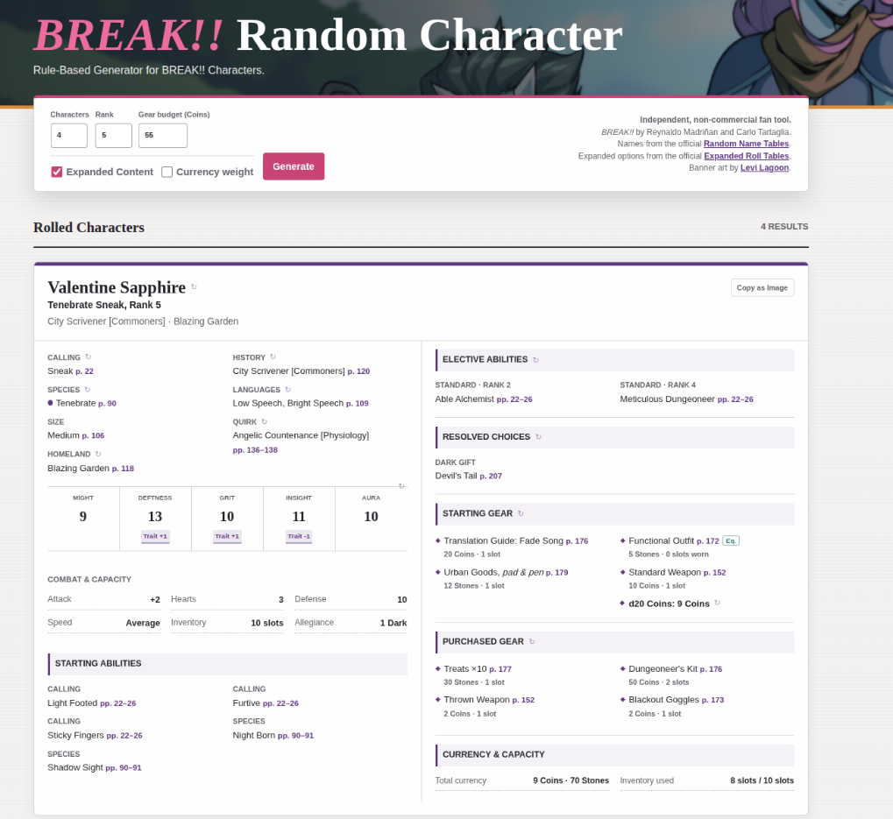
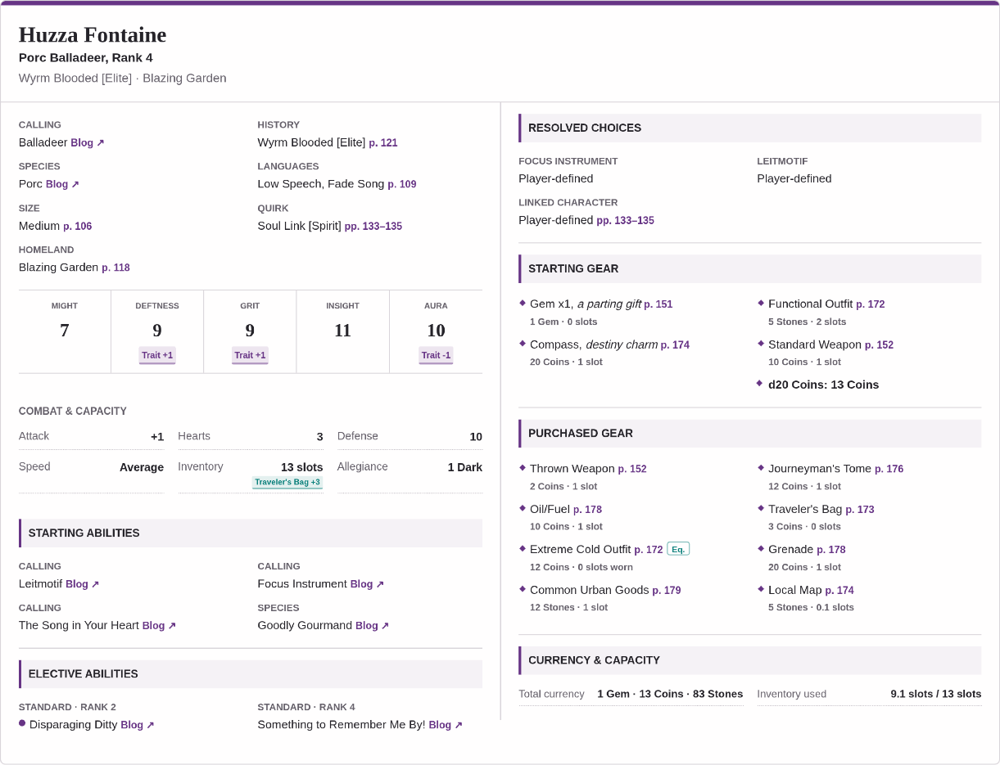
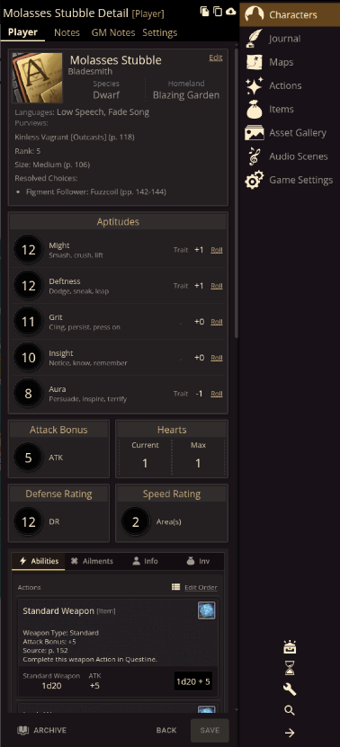
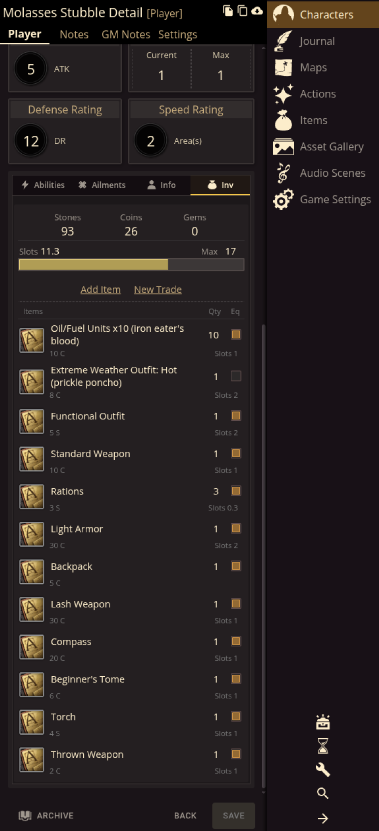

In the fair number of one-shots and short adventures I've run for BREAK!!, there has been an archetype of player I've had that genuinely loves playing but is always either 1) running late or 2) too lazy to build a character past the bare minimum...*if* that. For the sake of a smooth start time or giving them some damn Gear to use in-game, I'd lovingly roll them one up. Realizing I have the power of scripting - and the entirety of BREAK!! in standardized JSON format as a byproduct of the upcoming [REDACTED] project - well, this is the result.

For lack of a better name, here is my BREAK!! Random Character generator! Best used on desktop. **URL:** [https://its.quagg.studio/break-random-character/index.html](https://its.quagg.studio/break-random-character/index.html)

{: width="75%"}

One may ask: "Why Quagg there are a few that exist already, how is this one any different?" If "because it satisifies my neurons" isn't a good enough answer then:

- Novel to this generator, it has all of the BREAK!! Blog's [extra Callings and Species](https://breakrpg.blogspot.com/2026/06/blog-bonus-character-creation-tables.html) (Balladeer, Hoppalong, etc.)
- It can auto-generate a Character from Ranks 1-10, handling Attributes/Electives/etc.
- You can specify a Coin Budget and it will randomly-yet-smartly buy Items up to Budget or Slot limits.
- It auto-calculates a helluva lot like Aptitudes/Defense Rating/Allegiance Gifts from Items/Quirks/you-name-it.
- If an Ability has a choice in it (e.g., Wrath's Blade upgrades), it will pick them!
- You can copy a character card as an image and share easily.
- Each character component can be re-rolled, and it automatically updates everything.
- It considers Species-specific restrictions (e.g., Unterkin Calling restrictions).

Overall, it's pretty slick. It even has the [Porc](https://breakrpg.blogspot.com/2026/08/high-on-hog-freebie-species.html) Species, released just yesterday (as of this post)! Here is an example of a Porc Balladeer in all their glory:

**[August 30, 2026 Update]** After some more work on it, I am happy to say that I was able to get an auto-export to [QuestlineVTT](https://questlinevtt.com/) feature functional! There is a new button on each character card that downloads a {character-name}.characters file which can be easily imported into Questline. It builds out as much as it can within the non-commercial license, including Weapons Actions, Items, Ability outlines, etc. etc. Here is an example of an imported character:

I hope you might find some use out of it, or at least some fun in seeing what goobers churn out of the machine. I've tried to make it as readable as possible with just some hints of flare. If you have feedback or requests, I'd love to hear them!
